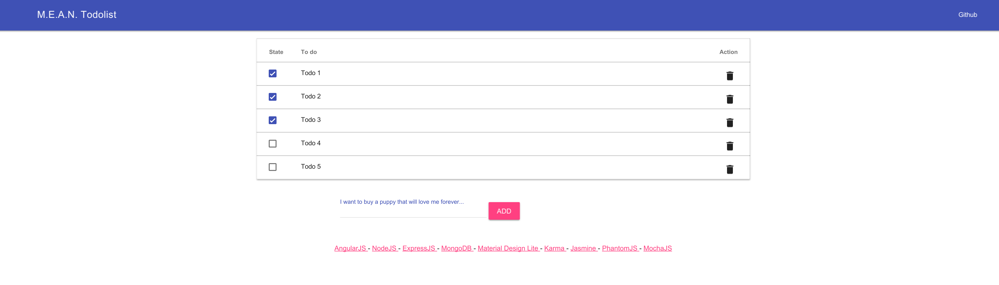

# POC d'une todolist fullstack M.E.A.N

Proof of concept d'une todolist M.E.A.N (MongoDB, ExpressJS, AngularJS, NodeJS) avec mise en oeuvre des frameworks MDL (Material Design Ligth), Karma, Jasmine, Mocha.



## Techonologies

### Backend

- [MongoDB](https://www.mongodb.org/) - Base de données NoSQL
- [NodeJS](https://nodejs.org/) - Utilisé comme serveur HTTP
- [ExpressJS](http://expressjs.com/) - Utilisé pour la mise en oeuvre de l'API


### Frontend

- [AngularJS](https://angularjs.org/) - Framework Javascript
- [Material Design Lite (MDL)](http://www.getmdl.io/) - Framework graphique

### Tests

- [Karma](http://karma-runner.github.io/)/[Jasmine](http://jasmine.github.io/) - Tests JS pour AngularJS
- [Mocha](http://mochajs.org/) - Tests NodeJS pour l'API


## Installation

```
$ git clone http://gitlab.penco.fr/romain/poc-mongodb-expressjs-angularjs-nodejs.git
$ cd ./poc-mongodb-expressjs-angularjs-nodejs
$ npm install
```

N.B: Prévoir une connexion `MongoDB`. Par exemple en utilisant le container MongoDB officiel: `docker run --name mongodb -d mongo` et en replaçant l'IP dans la configuration.

Pour les tests:
```
$ sudo npm install -g jasmine-core karma-jasmine karma karma-phantomjs-launcher karma-chrome-launcher
```

## Exécution

```
$ nodemon
```

## Tests

Backend/API (NodeJS):

```
$ npm start test-backend
```

Frontend (AngularJS):

```
$ npm start test-frontend
```
